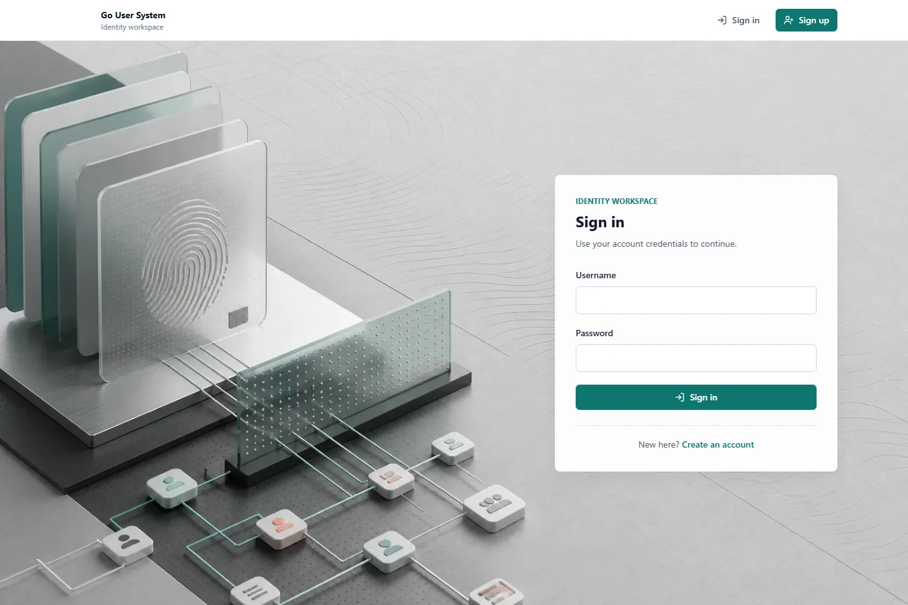

# Go User System

[](https://github.com/Yotoha0303/go-user-system/actions/workflows/ci.yml)
[](https://github.com/Yotoha0303/go-user-system/actions/workflows/codeql.yml)
[](LICENSE)

一个可自托管的全栈用户认证与 RBAC 项目。后端使用 Go、Gin、GORM、MySQL 和 Redis，前端使用 React、TypeScript 和 Vite。项目提供可重复的数据库迁移、完整容器栈、Kubernetes 清单、自动化测试和发布流水线。

当前公开交付版本为 `v1.0.0-rc.3`。这是候选版本，适合学习、二次开发和非关键环境验证；生产使用前请完成 `docs/deploy/production-checklist.md`。



## 功能

- 用户注册、登录、资料查询、昵称修改、密码修改和登出。
- JWT Access/Refresh 双 Token；Refresh Token 使用 HttpOnly Cookie、哈希存储和 Rotation。
- Token Family 重放检测、用户 `auth_version`、改密后全会话失效。
- 浏览器登出同步吊销当前 Access JTI；Web Locks 串行化多标签页 Refresh Rotation。
- Redis JTI 吊销和账号/IP 双维度登录失败限流，多副本环境下 fail-closed。
- 显式 Secure Cookie、可信代理 CIDR 和生产环境启动校验。
- RBAC 角色、权限、用户角色和角色权限模型，以及接口级权限中间件。
- 显式一次性管理员初始化，普通注册不再获得管理员权限。
- 可关闭的公开注册入口：`REGISTRATION_ENABLED=false`。
- 响应式 React 管理工作台、内存 Access Token、Cookie 会话恢复和权限路由。
- Swagger、健康检查、结构化日志、Request ID、超时和优雅关闭。
- `/version` 构建识别、Prometheus HTTP/运行时/readiness 指标和 4 条基础告警规则。
- 带 SHA-256 manifest 的 MySQL 备份脚本，以及仅允许 `_restore_test` 的恢复演练脚本。
- Compose 全栈、Kubernetes、CI、CodeQL、Dependabot 和 GHCR 发布。

## 快速开始

需要 Docker Engine 或 Docker Desktop，并启用 Docker Compose。

1. 创建本地环境文件：

```bash
cp .env.example .env
```

PowerShell：

```powershell
Copy-Item .env.example .env
```

2. 至少替换以下值：

```dotenv
DB_ROOT_PASSWORD=replace_with_a_strong_root_password
DB_PASSWORD=replace_with_a_different_app_password
JWT_SECRET=replace_with_a_32_plus_chars_random_secret
REGISTRATION_ENABLED=true
```

3. 构建并启动完整应用：

```bash
docker compose up -d --build --wait
```

Compose 会依次启动 MySQL、执行 Goose migration、启动 Redis、后端和前端。无需再手工运行 migration。

4. 创建第一个管理员：

```bash
export BOOTSTRAP_ADMIN_USERNAME=admin
export BOOTSTRAP_ADMIN_PASSWORD='replace-with-a-strong-password'
docker compose run --rm -e BOOTSTRAP_ADMIN_USERNAME -e BOOTSTRAP_ADMIN_PASSWORD app bootstrap-admin
```

PowerShell：

```powershell
$env:BOOTSTRAP_ADMIN_USERNAME="admin"
$env:BOOTSTRAP_ADMIN_PASSWORD="replace-with-a-strong-password"
docker compose run --rm -e BOOTSTRAP_ADMIN_USERNAME -e BOOTSTRAP_ADMIN_PASSWORD app bootstrap-admin
```

管理员只允许初始化一次。普通注册用户始终只绑定 `user` 角色。

5. 访问服务：

| 地址 | 用途 |
| --- | --- |
| `http://localhost:8080` | Web 应用 |
| `http://localhost:8082/swagger/index.html` | Swagger |
| `http://localhost:8082/readyz` | MySQL 与 Redis 就绪检查 |
| `http://localhost:8082/version` | 运行版本、提交和构建时间 |
| `http://localhost:8082/metrics` | Prometheus 指标；Compose 仅绑定本机，Kubernetes 不通过 Ingress 暴露 |

完整 Compose 说明见 `docs/deploy/local-compose.md`。

## 技术栈

| 区域 | 技术 |
| --- | --- |
| 后端 | Go 1.25.13、Gin、GORM、bcrypt、JWT |
| 数据 | MySQL 8.4、Redis 7.4、Goose migration |
| 前端 | React 18、TypeScript 5、Vite 8、Redux Toolkit、Tailwind CSS |
| 测试 | Go testing、httptest、miniredis、MySQL integration、Vitest、Testing Library、Playwright |
| 交付 | Docker、Compose、Kubernetes、GitHub Actions、GHCR |
| 安全 | govulncheck、npm audit、CodeQL、Dependabot、secret scanning |

## 项目结构

```text
cmd/                    后端入口与 bootstrap-admin 命令
config/                 配置加载、环境变量覆盖和校验
internal/               handler、service、repository、DAO、middleware、模型
pkg/                    MySQL 和 Redis 客户端
router/                 API、健康检查和 Swagger 路由
migrations/             Goose SQL migration
frontend/               React 应用、单元测试、Playwright 和 Nginx 镜像
k8s/                    Kubernetes 工作负载、迁移 Job、服务和 Ingress
deploy/monitoring/       Prometheus 配置与基础告警规则
scripts/ops/             MySQL 备份与隔离恢复演练脚本
docs/                   API、部署、迭代计划和操作记录
.github/                 CI、CodeQL、发布、模板和依赖更新配置
```

## 配置

非敏感默认值放在 `config.yml`，密码和密钥必须使用 `.env`、Shell 环境变量或部署平台 Secret 注入。

| 变量 | 说明 | Compose 默认 |
| --- | --- | --- |
| `DB_ROOT_PASSWORD` | 仅用于初始化 MySQL root | 必填 |
| `DB_PASSWORD` | 应用数据库账号密码 | 必填 |
| `JWT_SECRET` | HS256 密钥，至少 32 字符 | 必填 |
| `APP_ENV` | `development`、`test` 或 `production`；生产模式强制安全依赖 | `development` |
| `REGISTRATION_ENABLED` | 是否注册 `POST /api/v1/auth/register` | `true` |
| `REDIS_ENABLED` | 是否启用共享认证状态 | Compose 强制为 `true` |
| `REDIS_ADDR` | Redis 地址 | Compose 使用 `redis:6379` |
| `COOKIE_SECURE` | Refresh Cookie 是否强制添加 `Secure`；生产模式必须为 `true` | `false` |
| `TRUSTED_PROXIES` | 允许提供真实客户端 IP 的代理 IP/CIDR，逗号分隔 | Compose 网络 CIDR |
| `BOOTSTRAP_ADMIN_USERNAME` | 一次性管理员用户名 | 命令执行时必填 |
| `BOOTSTRAP_ADMIN_PASSWORD` | 一次性管理员密码 | 命令执行时必填 |
| `FRONTEND_PORT` / `BACKEND_PORT` | Compose 宿主机端口 | `8080` / `8082` |

所有支持的数据库、JWT、Redis 和 HTTP 参数见 `.env.example`、`config.yml` 与 `config/config.go`。密码策略为至少 12 个字符、最多 72 个 UTF-8 字节；登录对不存在用户、错误密码和禁用用户统一返回凭据错误。

## 本地开发

后端：

```bash
go mod download
make migrate-up
go run ./cmd
```

前端：

```bash
cd frontend
npm ci
npm run dev
```

前端开发服务器监听 `http://127.0.0.1:8888`，并把 `/api` 代理到 `http://localhost:8082`。本地 Goose 配置模板为 `.env.goose.example`。

## 测试与门禁

```bash
make lint
make test
make race-test
make vet
make security
make frontend-check
make migrate-validate
make observability-validate
```

MySQL 集成测试要求 `TEST_DATABASE_DSN` 指向数据库名包含 `test` 的专用库；测试工具会拒绝操作其他数据库。

完整浏览器测试需要先启动 Compose 栈并保持注册开启：

```bash
npx playwright install chromium --with-deps
npm --prefix frontend run test:e2e
```

GitHub CI 还会构建前后端镜像、校验 Compose/Kubernetes 清单，并在完整栈上执行 Playwright 流程。

## 最小可运维

在默认 Compose 栈上增加 Prometheus：

```powershell
make observability-validate
make observability-up
```

Prometheus 监听 `http://127.0.0.1:9090`，抓取后端 `/metrics`，并加载 TargetDown、NotReady、High5xxRate 和 HighP95Latency 四条规则。停止时执行：

```powershell
make observability-down
```

对运行中的 Compose MySQL 创建带校验和与 manifest 的备份：

```powershell
make ops-backup
```

恢复演练只能写入名称以 `_restore_test` 结尾的数据库，并要求显式指定备份：

```powershell
make ops-restore-drill BACKUP_PATH="backups/go_user_system-<timestamp>.sql"
```

完整说明见 `docs/deploy/observability.md` 和 `docs/deploy/backup-recovery.md`。这些能力用于本地和验收环境；生产仍需要外部告警路由、托管备份/PITR、MySQL/Redis 高可用和正式值班。

## API 概览

| 方法 | 路径 | 说明 |
| --- | --- | --- |
| `GET` | `/ping`、`/livez`、`/readyz` | 健康检查 |
| `POST` | `/api/v1/auth/register` | 注册，可通过配置关闭 |
| `POST` | `/api/v1/auth/login` | 登录并创建双 Token 会话 |
| `POST` | `/api/v1/auth/refresh` | 轮换 Refresh Token |
| `POST` | `/api/v1/auth/logout` | 吊销当前会话 |
| `GET` | `/api/v1/users/me` | 当前用户资料 |
| `GET` | `/api/v1/users/me/authorization` | 当前角色和权限 |
| `PUT` | `/api/v1/users/me/profile` | 修改昵称 |
| `PATCH` | `/api/v1/users/me/update/password` | 修改密码并使旧会话失效 |
| `GET` | `/api/v1/admin/roles` | 查询角色 |
| `GET` | `/api/v1/admin/permissions` | 查询权限 |
| `PUT` | `/api/v1/admin/users/:id/roles` | 分配用户角色 |

完整契约见 Swagger 和 `docs/http/test.http`。

## 部署与发布

- Compose：`docs/deploy/local-compose.md`
- Kubernetes：`docs/deploy/kubernetes.md`
- 可观测性：`docs/deploy/observability.md`
- 备份恢复：`docs/deploy/backup-recovery.md`
- 生产检查：`docs/deploy/production-checklist.md`
- 发布：推送 `v*` 标签后，Actions 构建多架构 GHCR 镜像、二进制、前端归档和 SHA-256 校验文件。
- 回滚：使用上一个固定版本镜像；数据库回滚前先确认 migration 的数据兼容性和备份。

## 项目文档

- `docs/operation-record-public-delivery.md`：本次公开交付节点、范围和验收记录。
- `docs/iteration-plan-public-delivery.md`：候选版本交付计划。
- `docs/iteration-plan-production-auth-hardening.md`：生产认证加固设计。
- `docs/operation-record-production-auth-hardening.md`：认证加固操作记录。
- `docs/operation-record-auth-delivery-hardening.md`：`rc.3` 浏览器认证、代理和生产配置加固记录。
- `docs/operation-record-frontend-modernization.md`：响应式前端工作台改造、视觉验收和交付记录。
- `docs/operation-record-minimum-operability.md`：版本、指标、告警、备份恢复和验收记录。
- `ROADMAP.md`：稳定版和后续能力规划。
- `CHANGELOG.md`：版本变更。

## 贡献与安全

提交改动前阅读 `CONTRIBUTING.md` 和 `CODE_OF_CONDUCT.md`。安全问题不要创建公开 Issue，请按 `SECURITY.md` 使用 GitHub 私有漏洞报告。

## License

[MIT](LICENSE)
